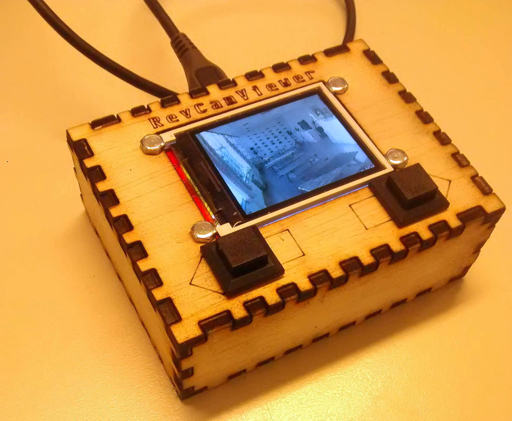

# RevCamViewer
It's an ESP module and a 1,8" TFT displaying pictures from RevSpace camera's.

See https://revspace.nl/Webcams for information about the cams.



## Hardware used
 - NodeMCU, because that's the easiest way to make the ESP8622 work (power, usb-serial, etc)
 - 1,8" 160x128 ST7735R Color TFT, [AliExpress](http://www.aliexpress.com/item/1pcs-128-160-1-8-SPI-Serial-Color-5-IO-port-TFT-LCD-Display-module-PCB/32580427243.html), [Adafruit](https://www.adafruit.com/product/358)

## Libraries used
### Arduino/ESP
 - https://github.com/esp8266/Arduino/
 - https://github.com/norm8332/ST7735_ESP8266
 - https://github.com/Bodmer/JPEGDecoder
 - https://github.com/thomasfredericks/Bounce2
 
### Python
 - requests
 - pillow

Both can be installed using pip:
```bash
pip3 install requests pillow
````
